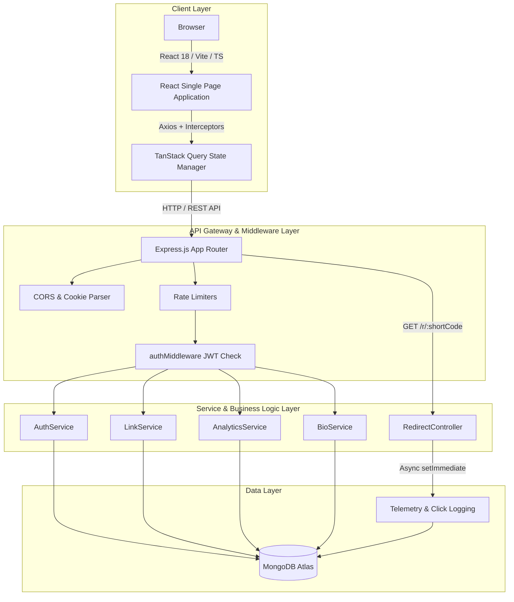
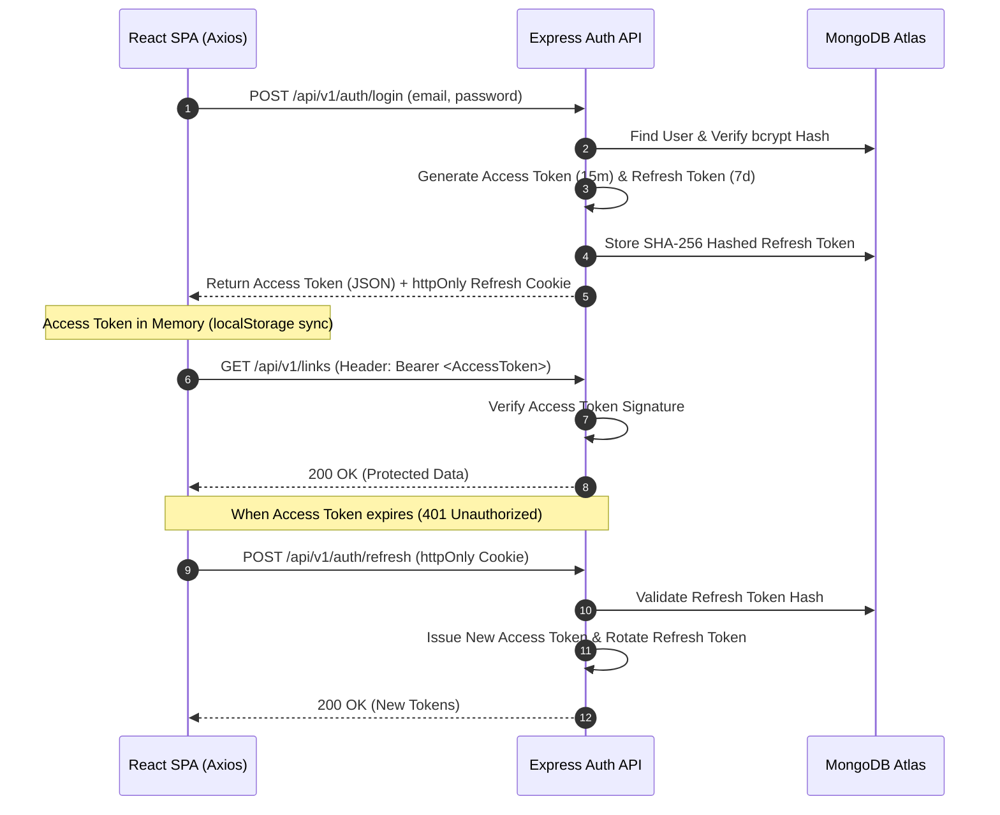
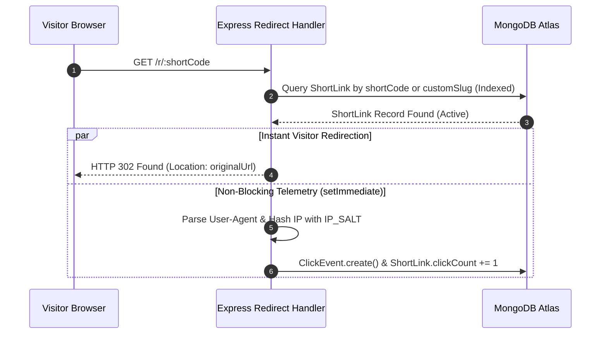

# Linkora

> **Branded links. Smarter sharing.**

Linkora is a full-stack URL shortening and link-in-bio platform designed for link management, privacy-focused click telemetry, and customizable digital identity pages. Built with modern TypeScript across the stack, Linkora combines security, responsive UI components, and real-time analytics into a web application.


---

## Live Demo

- **Live Application**: [https://linkora-frontend.netlify.app](https://linkora-frontend.netlify.app)
- **Backend API**: [https://linkora-backend-av48.onrender.com](https://linkora-backend-av48.onrender.com)
- **GitHub Repository**: [https://github.com/meheromprakash/Linkora](https://github.com/meheromprakash/Linkora)

---

## Walkthrough

**Demo Video:** [Link to be added]

---

## Table of Contents

- [Overview](#overview)
- [Live Demo](#live-demo)
- [Walkthrough](#walkthrough)
- [Assessment Requirement Coverage](#assessment-requirement-coverage)
- [Features](#features)
  - [Authentication & Security](#authentication--security)
  - [Short Links](#short-links)
  - [Analytics & Telemetry](#analytics--telemetry)
  - [Link Library](#link-library)
  - [Link-in-Bio](#link-in-bio)
  - [UI / UX](#ui--ux)
- [Architecture](#architecture)
  - [System Architecture](#system-architecture)
  - [Authentication Token Flow](#authentication-token-flow)
  - [Asynchronous Telemetry & Redirect Flow](#asynchronous-telemetry--redirect-flow)
- [Tech Stack](#tech-stack)
- [Database Models & Schemas](#database-models--schemas)
- [API Endpoints Reference](#api-endpoints-reference)
- [Environment Variables](#environment-variables)
- [Local Development & Setup](#local-development--setup)
- [Deployment Configuration](#deployment-configuration)
- [Known Limitations](#known-limitations)

---

## Overview

### Problem Statement
Standard URL shorteners often lack privacy-friendly click telemetry, custom domain branding, and integrated link-in-bio features. Existing tools either expose raw visitor IP addresses, rely on heavyweight external trackers, or split link management and digital identity pages into disconnected applications.

### Solution & Core Capabilities
Linkora solves these problems by providing a unified platform:
- **Indexed Short-Link Redirects & Click Telemetry**: Serves HTTP 302 redirects with non-blocking, asynchronous telemetry logging.
- **Privacy-First Click Telemetry**: Privacy-preserving IP hashing using HMAC-SHA256 with a configurable salt before storing click records.
- **Custom Vanity Slugs & QR Codes**: Supports collision-protected custom link aliases and on-the-fly QR code generation with instant PNG downloads.
- **Integrated Bio-Link Hub**: Generates customizable `/bio/:username` landing pages with real-time smartphone layout previews and theme customization.

### Intended User Workflow
1. **Account Registration**: Create an account with email verification (simulated for assessment).
2. **Link Shortening**: Input long destination URLs via the Coss UI Action Input Group particle, optionally defining a custom vanity slug and link title.
3. **Automatic Copy & Sharing**: Upon link creation, the full absolute short URL is automatically copied to the clipboard with visual toast feedback.
4. **Analytics Inspection**: Monitor aggregate clicks, daily time-series trends, top referrer domains, device types, and browser statistics.
5. **Bio-Link Customization**: Configure social handles, custom links, avatar URL, and visual themes (`minimal-light`, `dark-slate`, `gradient-neon`) for public bio sharing.

---

## Assessment Requirement Coverage

| Requirement | Implementation |
|---|---|
| JWT Authentication | Implemented |
| Refresh Tokens | Implemented |
| Email Verification Simulation | Implemented |
| Short Links | Implemented |
| Custom Vanity Slugs | Implemented |
| 302 Redirect | Implemented |
| Click Telemetry | Implemented |
| Analytics | Implemented |
| Coss UI | Implemented |
| QR Code Generator | Implemented |
| Bio-Link | Implemented |
| Theme Switcher | Implemented |
| Mobile Responsive Bio Page | Implemented |
| Rate Limiting | Implemented |

---

## Features

### Authentication & Security
- **Registration**: Account creation with Zod schema validation and duplicate email checks.
- **Simulated Email Verification**: Email verification token generation (`isVerified` flag) with a simulated verification endpoint for assessment workflows.
- **Login & JWT Architecture**: Dual-token authentication using short-lived Access Tokens (15-minute expiry, transmitted via `Authorization: Bearer <token>` headers) and long-lived Refresh Tokens (7-day expiry).
- **Token Storage**: Access tokens are maintained in application memory and synchronized with `localStorage` for session persistence across browser reloads. Refresh tokens are issued inside secure, `httpOnly`, `sameSite: 'lax'` cookies and stored as SHA-256 hashes in MongoDB for revocation capability.
- **Password Reset**: Token-based password reset workflow with simulated reset token return in API responses for evaluation convenience.
- **Protected Routes**: Express middleware (`authMiddleware`) validating Bearer JWTs on restricted endpoints.
- **Rate Limiting**: Tiered endpoint protection using `express-rate-limit`:
  - **Auth Rate Limiter**: 15 requests / 15 minutes (`/api/v1/auth/*`).
  - **Link Creation Limiter**: 30 requests / 15 minutes (`/api/v1/links`).
  - **Redirect Limiter**: 200 requests / 1 minute (`/r/:shortCode`).
- **Password Hashing**: Cryptographic password hashing using `bcryptjs` with salt rounds.

### Short Links
- **Automatic Short-Code Generation**: Collision-resistant 7-character random code generation via `nanoid`.
- **Custom Vanity Slugs**: User-defined custom aliases (e.g., `/r/summer-sale`) with case-insensitive collision protection.
- **Duplicate Slug Detection**: Returns HTTP 409 Conflict if a custom slug is already registered.
- **URL Validation**: Strict URL format parsing via Zod schemas before database insertion.
- **HTTP 302 Redirects**: HTTP 302 redirection (`res.redirect(302, link.originalUrl)`) with styled 404 HTML fallback pages for inactive or invalid codes.
- **Click Telemetry Trigger**: Non-blocking `setImmediate` execution for logging click events without adding latency to visitor redirects.
- **Clipboard Functionality**: Automatic clipboard copy on link creation and manual copy buttons with success toast notifications.

### Analytics & Telemetry
Every short link click records structured telemetry without blocking the HTTP redirect:
- **Timestamp**: Exact click timestamp (`Date.now()`).
- **Referrer Domain**: Normalized referrer hostname (e.g., `github.com`, `twitter.com`) or `Direct / None`.
- **Device Type**: Parsed via `ua-parser-js` into `desktop`, `mobile`, `tablet`, `bot`, or `unknown`.
- **Browser & OS**: User agent breakdown for browser and operating system analytics.
- **IP Hashing**: Privacy-preserving IP hashing using HMAC-SHA256 with a configurable `IP_SALT`. Raw IP addresses are never stored in the database.
- **Click Counts**: Atomic `$inc` updates on the `ShortLink` model and `$set` updates for `lastClickedAt`.

#### Implemented Analytics Aggregations:
- **Summary Overview**: Total links, active links, aggregate click count, and top-performing link identifier.
- **Time-Series Daily Trend**: Continuous date range click timeline over 7-day or 30-day windows.
- **Referrers Breakdown**: Top 6 referral sources with click counts.
- **Device Distribution**: Categorized device percentages for pie/donut chart visualization.
- **Browser Breakdown**: Top 5 visitor browser statistics.

### Link Library
- **Search**: Case-insensitive regex search across link titles, original URLs, short codes, and vanity slugs.
- **Pagination**: Server-side pagination returning total items, total pages, current page, `hasNextPage`, and `hasPrevPage`.
- **Instant Copy**: Copy short link URL to clipboard with visual copied indicator.
- **QR Generation**: Canvas-rendered QR codes (`qrcode.react`) in a portal modal with instant PNG download capability.
- **Cascade Deletion**: Confirmation dialog and atomic deletion of short links along with all associated `ClickEvent` telemetry records.
- **Link Management**: Toggle link active/disabled status and edit link metadata.

### Link-in-Bio
- **Public Profile Route**: Dedicated `/bio/:username` route accessible publicly without authentication.
- **Identity Fields**: Customizable display name, bio text description (250 char limit), and avatar image URL with initial avatar fallback.
- **Social Handles**: Structured links for GitHub, Twitter/X, LinkedIn, Website, Instagram, and YouTube.
- **Visual Themes**:
  - `minimal-light`: Clean slate-light background with crisp border cards.
  - `dark-slate`: Deep navy background (`#0B1324`) with dark slate card containers.
  - `gradient-neon`: Dark emerald gradient (`#090D16` to `#0F241A`) with glowing neon green accents.
- **Live Smartphone Preview**: Real-time phone frame preview in `BioBuilderPage.tsx` with instant theme state transitions.

### UI / UX
- **Coss UI Integration**: Integrated the official Coss UI Action Input Group particle (`CossActionInput`) featuring a leading icon, clear input trigger, expandable vanity slug controls, and high-contrast action button.
- **Responsive Design**: Audited and optimized across mobile screen sizes (320px, 375px, 390px, 430px) and desktop screens.
- **Mobile Drawer Navigation**: Slide-in mobile navigation menu with backdrop blur overlay and touch-friendly target spacing.
- **Toast Notifications**: Built-in Toast notification provider (`Toast.tsx`) with animated auto-dismiss progress bars and type styling (`success`, `error`, `info`).
- **Portal Modals**: Screen-centered overlay modals (`Modal.tsx`, `ConfirmDialog.tsx`, `QRModal.tsx`) attached to `document.body` with `z-[100]`.

---

## Architecture

### System Architecture



### Authentication Token Flow



### Asynchronous Telemetry & Redirect Flow



---

## Tech Stack

### Frontend
| Dependency | Version | Purpose |
| :--- | :--- | :--- |
| **React** | `18.2.0` | UI Library |
| **Vite** | `5.2.8` | Build Tool & Dev Server |
| **TypeScript** | `5.4.5` | Type Safety |
| **Tailwind CSS** | `3.4.3` | Utility-First CSS Styling |
| **TanStack Query** | `5.29.2` | Server State & Data Fetching |
| **Axios** | `1.6.8` | HTTP Client with Interceptors |
| **React Router DOM** | `6.22.3` | Client-Side Routing |
| **Recharts** | `2.12.5` | Analytics Charts & Visualizations |
| **Lucide React** | `0.368.0` | Icon System |
| **QRCode.react** | `3.1.0` | Canvas QR Code Generation |
| **React Hook Form** | `7.51.3` | Form State Management |
| **Zod** | `3.22.4` | Form Schema Validation |
| **Clsx & Tailwind Merge** | `2.1.0` / `2.2.2` | Dynamic Class Composition |

### Backend
| Dependency | Version | Purpose |
| :--- | :--- | :--- |
| **Node.js** | `>=18` | JavaScript Runtime |
| **Express** | `4.19.2` | Web Framework |
| **TypeScript** | `5.4.5` | Type Safety |
| **Mongoose** | `8.3.1` | MongoDB Object Data Modeling (ODM) |
| **JSONWebToken** | `9.0.2` | Access & Refresh Token Authentication |
| **BcryptJS** | `2.4.3` | Cryptographic Password Hashing |
| **NanoID** | `3.3.7` | Short-Code Generator |
| **Express Rate Limit** | `7.2.0` | IP Rate Limiting Middleware |
| **UA-Parser-JS** | `1.0.37` | User-Agent Device & Browser Parser |
| **Cookie Parser** | `1.4.6` | HTTP Cookie Parsing |
| **Cors** | `2.8.5` | Cross-Origin Resource Sharing |
| **Zod** | `3.22.4` | Environment & Payload Schema Validation |

---

## Database Models & Schemas

### 1. User Model (`User.ts`)
Stores user identity, authentication credentials, and token states.
- `name`: String (Required, max 50 chars)
- `email`: String (Required, Unique, Lowercase, **Indexed**)
- `passwordHash`: String (Required, `select: false`)
- `isVerified`: Boolean (Default: `false`)
- `verificationToken`: String (`select: false`)
- `verificationExpires`: Date (`select: false`)
- `resetPasswordToken`: String (`select: false`)
- `resetPasswordExpires`: Date (`select: false`)
- `refreshTokenHash`: String (`select: false`)
- `timestamps`: `createdAt`, `updatedAt`

### 2. ShortLink Model (`ShortLink.ts`)
Stores shortened link definitions, target URLs, custom vanity slugs, and aggregate click counters.
- `userId`: ObjectId (Ref: `User`, Required, **Indexed**)
- `originalUrl`: String (Required, Trimmed)
- `shortCode`: String (Required, Unique, Trimmed, **Indexed**)
- `customSlug`: String (Unique, Sparse, Trimmed, Lowercase)
- `title`: String (Required, Default: `'Untitled Link'`)
- `isActive`: Boolean (Default: `true`)
- `clickCount`: Number (Default: `0`)
- `lastClickedAt`: Date
- `tags`: Array of Strings
- `timestamps`: `createdAt`, `updatedAt`

### 3. ClickEvent Model (`ClickEvent.ts`)
Stores immutable event records for click telemetry analysis.
- `linkId`: ObjectId (Ref: `ShortLink`, Required, **Indexed**)
- `shortCode`: String (Required, **Indexed**)
- `timestamp`: Date (Default: `Date.now`, **Indexed**)
- `referrer`: String (Default: `'Direct / None'`)
- `deviceType`: String (Enum: `['desktop', 'mobile', 'tablet', 'bot', 'unknown']`)
- `browser`: String (Default: `'Unknown'`)
- `os`: String (Default: `'Unknown'`)
- `ipHash`: String (Required, HMAC-SHA256 hashed IP)
- `country`: String (Default: `'Unknown'`)

### 4. BioProfile Model (`BioProfile.ts`)
Stores digital bio-link page configurations.
- `userId`: ObjectId (Ref: `User`, Required, Unique, **Indexed**)
- `username`: String (Required, Unique, Lowercase, **Indexed**)
- `displayName`: String (Required)
- `bio`: String (Default: `''`, Max 250 chars)
- `avatarUrl`: String (Default: `''`)
- `theme`: String (Enum: `['minimal-light', 'dark-slate', 'gradient-neon']`, Default: `'gradient-neon'`)
- `links`: Array of `BioLinkSchema` (`id`, `title`, `url`, `icon`, `shortLinkId`, `isActive`, `order`)
- `socials`: `BioSocialsSchema` (`twitter`, `github`, `linkedin`, `instagram`, `youtube`, `website`)
- `timestamps`: `createdAt`, `updatedAt`

---

## API Endpoints Reference

### Authentication Routes (`/api/v1/auth`)
| Method | Endpoint | Protection | Rate Limit | Description |
| :--- | :--- | :--- | :--- | :--- |
| `POST` | `/api/v1/auth/register` | Public | 15 req / 15m | Register new account & return verification token |
| `POST` | `/api/v1/auth/verify-email` | Public | 15 req / 15m | Verify account email address via token |
| `POST` | `/api/v1/auth/login` | Public | 15 req / 15m | Authenticate user & issue Access Token + httpOnly Cookie |
| `POST` | `/api/v1/auth/refresh` | Public (Cookie) | - | Rotate Refresh Token & issue new Access Token |
| `POST` | `/api/v1/auth/logout` | Bearer Token | - | Revoke refresh token hash & clear httpOnly cookie |
| `POST` | `/api/v1/auth/forgot-password` | Public | 15 req / 15m | Process password reset & generate simulated reset token |
| `POST` | `/api/v1/auth/reset-password` | Public | 15 req / 15m | Reset user password using token |
| `GET` | `/api/v1/auth/me` | Bearer Token | - | Fetch authenticated user profile |

### Short Link Routes (`/api/v1/links`)
| Method | Endpoint | Protection | Rate Limit | Description |
| :--- | :--- | :--- | :--- | :--- |
| `POST` | `/api/v1/links` | Bearer Token | 30 req / 15m | Create shortened URL with optional custom slug & title |
| `GET` | `/api/v1/links` | Bearer Token | - | Fetch user links with search & pagination |
| `GET` | `/api/v1/links/:id` | Bearer Token | - | Fetch short link details by ID |
| `PATCH` | `/api/v1/links/:id` | Bearer Token | - | Update link metadata or toggle active status |
| `DELETE` | `/api/v1/links/:id` | Bearer Token | - | Delete short link & cascade delete click events |

### Public Redirect Route (`/r`)
| Method | Endpoint | Protection | Rate Limit | Description |
| :--- | :--- | :--- | :--- | :--- |
| `GET` | `/r/:shortCode` | Public | 200 req / 1m | HTTP 302 redirect & async click telemetry logging |

### Analytics Routes (`/api/v1/analytics`)
| Method | Endpoint | Protection | Description |
| :--- | :--- | :--- | :--- |
| `GET` | `/api/v1/analytics/summary` | Bearer Token | Fetch summary metrics (total links, clicks, top link) |
| `GET` | `/api/v1/analytics/details` | Bearer Token | Fetch detailed time-series, referrers, devices, & browsers |

### Link-in-Bio Routes (`/api/v1/bio`)
| Method | Endpoint | Protection | Description |
| :--- | :--- | :--- | :--- |
| `GET` | `/api/v1/bio/me` | Bearer Token | Get or auto-create bio profile for logged-in user |
| `PUT` | `/api/v1/bio/me` | Bearer Token | Update bio profile settings, links, theme, & socials |
| `GET` | `/api/v1/bio/public/:username` | Public | Fetch public bio profile by username slug |

### System Routes
| Method | Endpoint | Protection | Description |
| :--- | :--- | :--- | :--- |
| `GET` | `/api/v1/health` | Public | System health check returning status & timestamp |

---

## Environment Variables

### Backend Configuration (`backend/.env`)
Validated at startup via Zod in `backend/src/config/env.ts`:

```env
PORT=5000
NODE_ENV=development
MONGO_URI=mongodb+srv://<username>:<password>@<cluster>/<database>
JWT_ACCESS_SECRET=replace_with_a_secure_random_secret
JWT_REFRESH_SECRET=replace_with_a_secure_random_secret
CLIENT_URL=http://localhost:5173
BASE_URL=http://localhost:5000
IP_SALT=replace_with_a_secure_random_salt
```

### Frontend Configuration (`frontend/.env`)

```env
VITE_API_URL=http://localhost:5000/api/v1
```

---

## Local Development & Setup

### Prerequisites
- **Node.js**: v18.x or higher
- **npm**: v9.x or higher
- **MongoDB**: Local MongoDB instance or MongoDB Atlas Cluster URI

### 1. Repository Setup
```bash
git clone https://github.com/meheromprakash/Linkora.git
cd Linkora
```

### 2. Backend Setup
```bash
cd backend
npm install
```

Create `backend/.env` file:
```env
PORT=5000
NODE_ENV=development
MONGO_URI=mongodb://localhost:27017/linkora
JWT_ACCESS_SECRET=replace_with_a_secure_random_secret
JWT_REFRESH_SECRET=replace_with_a_secure_random_secret
CLIENT_URL=http://localhost:5173
BASE_URL=http://localhost:5000
IP_SALT=replace_with_a_secure_random_salt
```

Build & Start Dev Server:
```bash
npm run dev
```
*The backend API will start on `http://localhost:5000`.*

### 3. Database Seeding (Optional)
To seed test data (sample users, short links, and historical click telemetry):
```bash
npm run seed
```

### 4. Frontend Setup
In a new terminal window:
```bash
cd frontend
npm install
```

Create `frontend/.env` file:
```env
VITE_API_URL=http://localhost:5000/api/v1
```

Start Dev Server:
```bash
npm run dev
```
*The frontend application will start on `http://localhost:5173`.*

---

## Deployment Configuration

Linkora is configured for production deployment across Render (Backend) and Netlify (Frontend):

### Backend Deployment (Render)
- **Production API URL**: `https://linkora-backend-av48.onrender.com`
- **Build Command**: `npm run build` (`tsc`)
- **Start Command**: `npm start` (`node dist/server.js`)
- **Environment Variables**: Configure `MONGO_URI`, `JWT_ACCESS_SECRET`, `JWT_REFRESH_SECRET`, `CLIENT_URL`, `BASE_URL`, and `IP_SALT`.

### Frontend Deployment (Netlify)
- **Production Web Application**: `https://linkora-frontend.netlify.app`
- **Build Command**: `npm run build` (`tsc && vite build`)
- **Publish Directory**: `dist`
- **Proxy Configuration** (`netlify.toml`): Single-origin proxy redirects for API routes and public short links (`/r/:shortCode`), eliminating CORS issues and supporting clean short link paths.

```toml
[build]
  command = "npm run build"
  publish = "dist"

[[redirects]]
  from = "/api/*"
  to = "https://linkora-backend-av48.onrender.com/api/:splat"
  status = 200
  force = true

[[redirects]]
  from = "/r/*"
  to = "https://linkora-backend-av48.onrender.com/r/:splat"
  status = 200
  force = true

[[redirects]]
  from = "/*"
  to = "/index.html"
  status = 200
```

---

## Known Limitations

- **Email Verification Delivery**: Email verification token delivery is simulated for the assessment rather than sent through a real email service provider.
